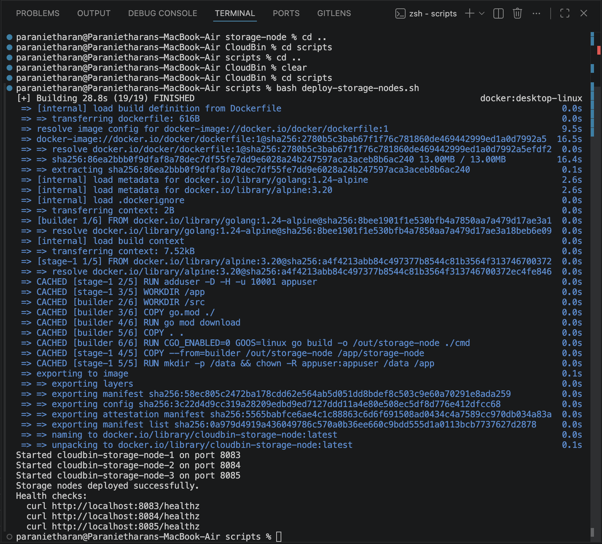

## Steps to run the project

## Prerequisites
- Docker
- Go version 1.26 or higher
- PostgreSQL version 15 or higher
- Redis version 7 or higher

## Running the project
1. Clone the repository:
```bash
git clone https://github.com/paranietharan/CloudBin.git
```

2. Navigate to the project directory:
```bash
cd CloudBin
```

3. Create a `.env` file in the root directory and add the necessary environment variables. You can refer to the `.env.example` file for the required variables.

4. For the Storage node here I am using 3 docker container to run the storage node. Also I created a bash script to run the storage node. You can run the storage node using the following command:
```bash
cd scripts
```
```bash
bash deploy-storage-nodes.sh
```



5. Start all the services
```bash
cd api-gateway
```
```bash
go run ./cmd
```

```bash
cd auth-service
```
```bash
go run ./cmd
```

```bash
cd object-api
```
```bash
go run ./cmd
```

